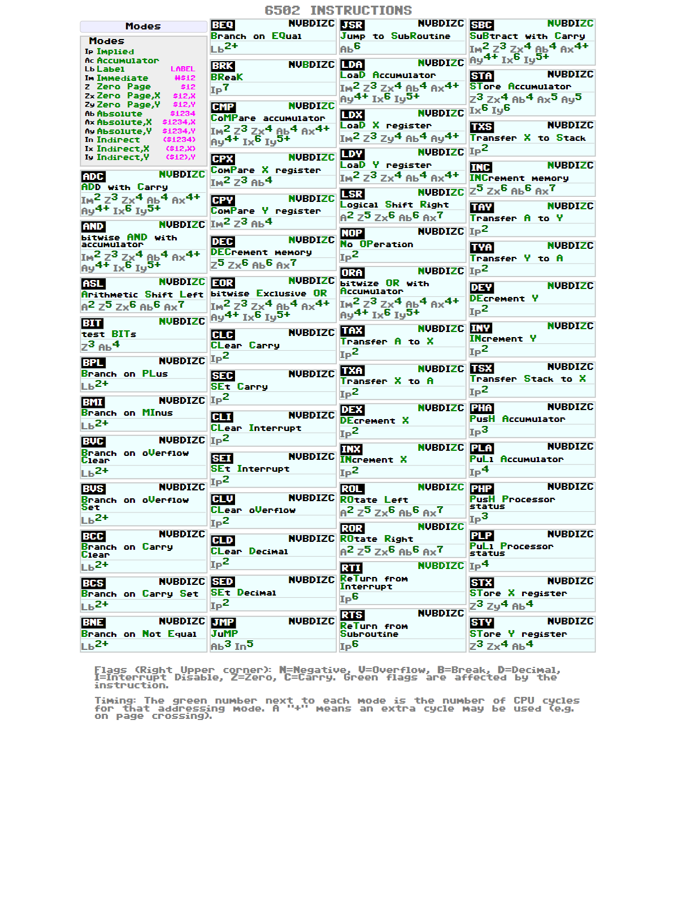

# [6502/65C02 CPU Cheat Sheet Generator](https://oleg-imanilov.github.io/cheat-sheet-6502/)

##                  [Browse and download](https://oleg-imanilov.github.io/cheat-sheet-6502/)

A simple, direct generator for creating 6502 and 65C02 CPU instruction cheat sheets in PNG and PDF formats.

## Quick Start

1. Install dependencies:
```bash
npm install
```

2. Generate cheat sheets:
```bash
npm run generate           # Generate both PNG and PDF for both CPUs
npm run generate-png       # Generate PNG files only
npm run generate-pdf       # Generate PDF files only
npm run generate-both      # Generate both PNG and PDF for both CPUs
npm run generate-html      # Generate interactive HTML files only
npm run generate-hex-table # Generate 6502 hexadecimal instruction table
npm run generate-65C02-hex-table # Generate 65C02 hexadecimal instruction table
npm run generate-all       # Generate all files (PNG, PDF, HTML, and hex tables)
```

## Output

Generated files will be saved in the `docs/` directory:
- `cheat-sheet-6502.png` / `cheat-sheet-6502.pdf` / `cheat-sheet-6502.html`
- `cheat-sheet-65C02.png` / `cheat-sheet-65C02.pdf` / `cheat-sheet-65C02.html`
- `6502-hex-table.html` - 6502 hexadecimal instruction reference table
- `65C02-hex-table.html` - 65C02 hexadecimal instruction reference table
- `index.html` - Landing page with links to both HTML cheat sheets

### HTML Features

The HTML versions include interactive features:
- **Click to highlight**: Click any instruction card to highlight it
- **Search functionality**: Press `Ctrl+F` to search for specific instructions
- **Print optimized**: Press `Ctrl+P` for clean printing
- **Responsive design**: Works on desktop, tablet, and mobile devices
- **Keyboard shortcuts**: 
  - `Ctrl+F`: Toggle search
  - `Ctrl+P`: Print
  - `ESC`: Clear highlights
  - `1` / `2`: Navigate between CPUs (on index page)

**To use**: Open `docs/index.html` in your web browser for a landing page with links to both cheat sheets, or directly open the individual HTML files.

## Structure

```
├── cpus/                    # CPU instruction data
│   ├── 6502.js             # 6502 CPU instructions
│   └── 65C02.js            # 65C02 CPU instructions
├── scripts/
│   ├── generate-direct.js         # PNG/PDF generation script
│   ├── generate-html.js           # HTML static generation script
│   ├── generate-hex-table.js      # 6502 hex table generation script
│   ├── generate-65C02-hex-table.js # 65C02 hex table generation script
│   └── common-html-generator.js   # Shared HTML generation utilities
├── static/
│   └── C64_Pro-STYLE.ttf   # Font file
├── docs/                   # Generated cheat sheets
└── package.json
```



