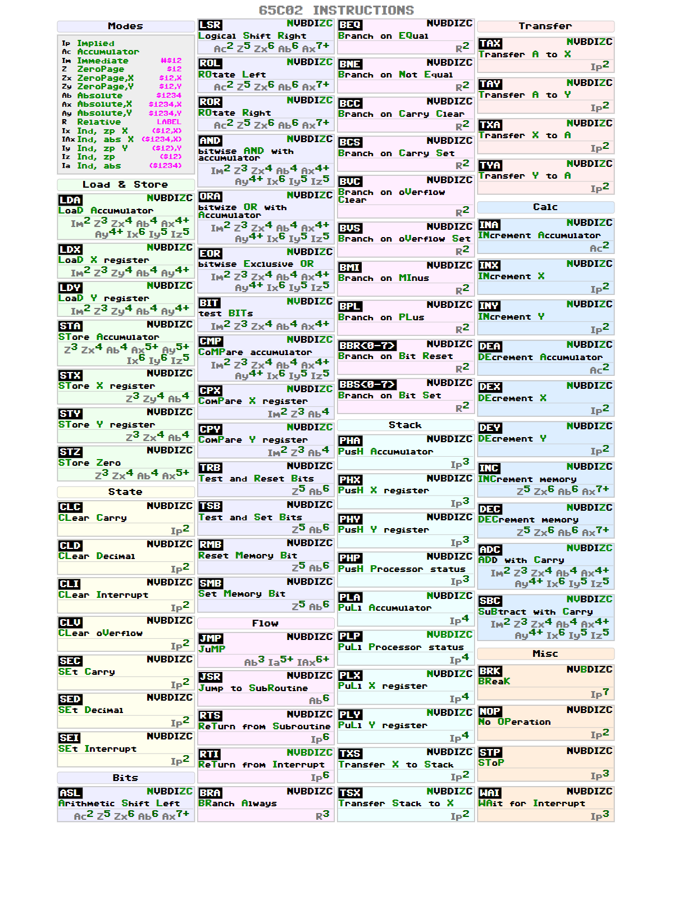

# 6502/65C02 CPU Cheat Sheet Generator

A simple, direct generator for creating 6502 and 65C02 CPU instruction cheat sheets in PNG and PDF formats.

## Quick Start

1. Install dependencies:
```bash
npm install
```

2. Generate cheat sheets:
```bash
npm run generate        # Generate both PNG and PDF for both CPUs
npm run generate-png    # Generate PNG files only
npm run generate-pdf    # Generate PDF files only
```

## Output

Generated files will be saved in the `output/` directory:
- `cheat-sheet-6502.png` / `cheat-sheet-6502.pdf`
- `cheat-sheet-65C02.png` / `cheat-sheet-65C02.pdf`

## Structure

```
├── cpus/                    # CPU instruction data
│   ├── 6502.js             # 6502 CPU instructions
│   └── 65C02.js            # 65C02 CPU instructions
├── scripts/
│   └── generate-direct.js  # Main generation script
├── static/
│   └── C64_Pro-STYLE.ttf   # Font file
├── output/                 # Generated cheat sheets
└── package.json
```



